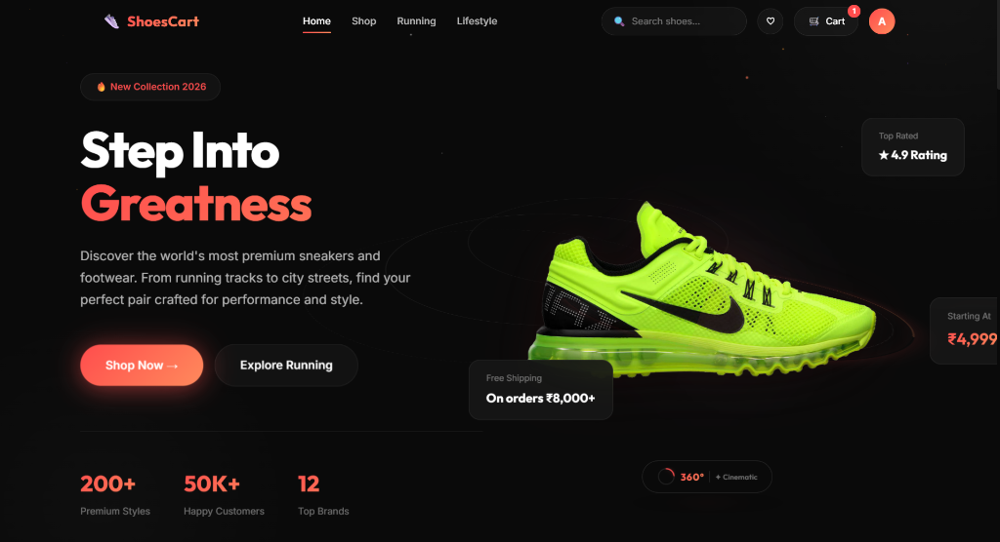
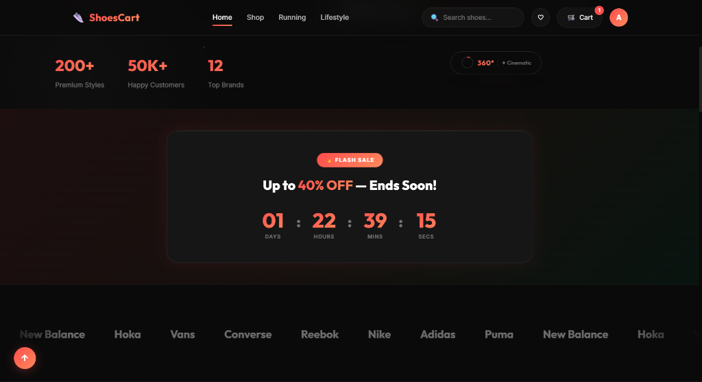
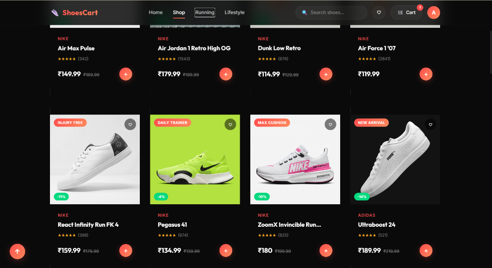
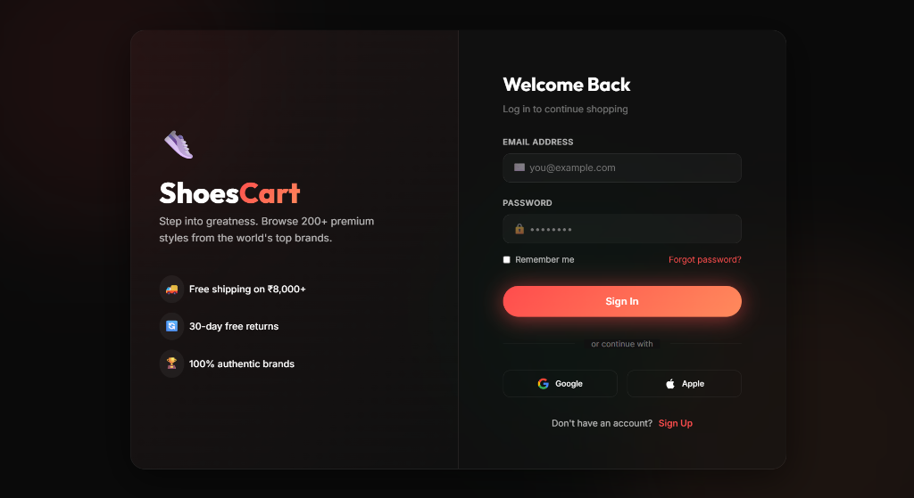
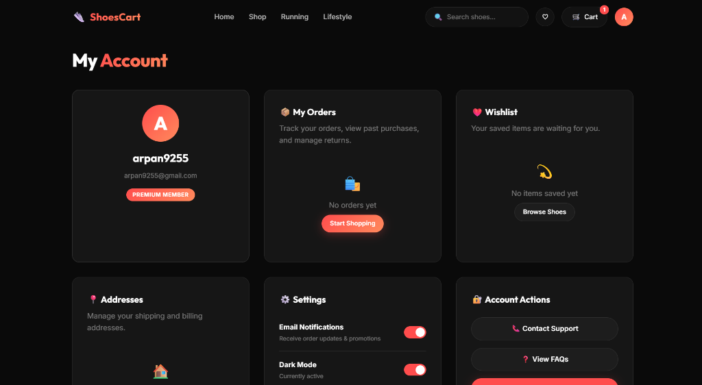

# 👟 ShoesCart

**A modern, premium online sneaker & footwear shopping platform**
*Built with React, Node.js, Express & Vanilla CSS*


---

## 📸 Screenshots

### 🏠 Home Page — Hero Section
A cinematic hero section featuring the latest sneaker collection, animated counters for key stats (200+ styles, 50K+ customers, 12 top brands), and a 360° product showcase.



### 🔥 Flash Sale & Countdown Timer
Eye-catching flash sale banner with a live countdown timer, up to 40% off deals, and an infinite scrolling brand marquee (Nike, Adidas, Puma, Hoka, Vans & more).



### 🛍️ Shop Page — Product Catalog
Browse premium sneakers from world-class brands with discount badges, star ratings, wishlist toggles, quick-add buttons, and category-based tags (Injury Free, Daily Trainer, Max Cushion, New Arrival).



### 🔐 Login Page
Sleek, dark-themed sign-in experience with email & password fields, social login options (Google & Apple), trust badges (free shipping, 30-day returns, authentic brands), and a glassmorphism design.



### 👤 Account Dashboard
Full-featured account page with profile card, order tracking, wishlist overview, address management, notification settings, dark mode toggle, and quick-access support links.



---

## ✨ Features

### 🛍️ Shopping Experience
- **Hero Section** — Cinematic landing with animated stats, 360° product viewer, and free shipping callout
- **Product Catalog** — Browse 200+ premium sneakers from top brands
- **Flash Sales** — Countdown timer with live deals and up to 40% off
- **Brand Marquee** — Infinite scrolling banner showcasing all partner brands
- **Quick View** — Modal product preview without leaving the current page
- **Advanced Search** — Real-time product search with instant results

### 👟 Product Details
- **Detailed Product Pages** — High-res images, size/color selectors, specifications
- **Category Tags** — Injury Free, Daily Trainer, Max Cushion, New Arrival badges
- **Discount Badges** — Percentage-off labels on discounted products
- **Star Ratings & Reviews** — Aggregated ratings with review counts

### 🔐 Authentication & Accounts
- **User Registration & Login** — Secure sign-up with email & password
- **Social Login UI** — Google & Apple login buttons
- **Protected Routes** — Authenticated access to shop, cart, and account
- **Persistent Sessions** — LocalStorage-based user session management
- **Account Dashboard** — Profile, orders, settings, and support hub

### 🛒 Cart & Wishlist
- **Shopping Cart** — Add/remove items with size and color variants
- **Quantity Management** — Update item quantities in real-time
- **Wishlist** — Save favorite shoes with persistent localStorage
- **Cart Badge** — Live item count on the navbar cart icon

### 📦 Support Center
- **Contact Page** — Reach out to customer support
- **FAQ** — Frequently asked questions
- **Shipping Info** — Delivery timelines and policies
- **Returns & Exchanges** — Return policy details
- **Size Guide** — Find your perfect fit

### 🎨 UI/UX
- **Dark Theme** — Premium dark mode design throughout the app
- **Glassmorphism** — Frosted glass effects on cards and modals
- **Micro-Animations** — Smooth hover effects, transitions, and interactive elements
- **Animated Counters** — Intersection Observer-powered stat counters
- **Skeleton Loading** — Graceful loading states for product cards
- **Back to Top** — Smooth scroll-to-top button
- **Toast Notifications** — Feedback toasts with progress bar animations
- **Responsive Layout** — Seamlessly adapts to desktop and mobile screens

---

## 🛠️ Tech Stack

### Frontend
| Technology | Purpose |
|---|---|
| **React 19** | UI component library |
| **Vite 6** | Build tool & dev server |
| **React Router DOM v7** | Client-side routing & navigation |
| **Vanilla CSS** | Custom styling with dark theme, animations, glassmorphism |
| **JavaScript (ES Modules)** | Application logic |

### Backend
| Technology | Purpose |
|---|---|
| **Node.js** | Server runtime |
| **Express 5** | REST API framework |
| **CORS** | Cross-Origin Resource Sharing |
| **dotenv** | Environment variable management |

### DevOps & Tooling
| Technology | Purpose |
|---|---|
| **Vercel** | Frontend deployment |
| **Nodemon** | Auto-restart dev server |
| **Pexels API** | Product image sourcing |
| **Git** | Version control |

---

## 📁 Project Structure

```
ShoesCart/
├── frontend/                    # React + Vite frontend
│   ├── src/
│   │   ├── components/          # Reusable UI components
│   │   │   ├── BackToTop.jsx        # Scroll-to-top button
│   │   │   ├── CountdownBanner.jsx  # Flash sale countdown timer
│   │   │   ├── Footer.jsx           # Site footer
│   │   │   ├── Navbar.jsx           # Navigation bar with search & cart
│   │   │   ├── ProductCard.jsx      # Product display card
│   │   │   ├── QuickView.jsx        # Quick view product modal
│   │   │   └── SkeletonCard.jsx     # Loading skeleton placeholder
│   │   ├── pages/               # Route pages
│   │   │   ├── Home.jsx             # Landing page with hero & stats
│   │   │   ├── Shop.jsx             # Product catalog & filters
│   │   │   ├── ProductDetail.jsx    # Individual product page
│   │   │   ├── Cart.jsx             # Shopping cart
│   │   │   ├── Login.jsx            # Sign in / Register
│   │   │   ├── Account.jsx          # User account dashboard
│   │   │   ├── Wishlist.jsx         # Saved items
│   │   │   └── support/            # Support pages
│   │   │       ├── Contact.jsx      # Contact form
│   │   │       ├── FAQ.jsx          # Frequently asked questions
│   │   │       ├── Shipping.jsx     # Shipping information
│   │   │       ├── Returns.jsx      # Returns & exchanges
│   │   │       └── SizeGuide.jsx    # Size guide reference
│   │   ├── hooks/               # Custom React hooks
│   │   │   └── useDriftReveal.js    # Intersection Observer animation hook
│   │   ├── App.jsx              # Root app component & routing
│   │   ├── main.jsx             # Entry point
│   │   └── index.css            # Global styles & design system
│   ├── public/
│   │   ├── images/              # Static image assets
│   │   └── shoes/               # Product shoe images
│   ├── vite.config.js           # Vite configuration with API proxy
│   └── package.json
│
├── backend/                     # Node.js + Express API
│   ├── data/
│   │   └── shoes.js                 # Product data store
│   ├── routes/
│   │   ├── shoeRoutes.js            # Shoe product API routes
│   │   └── cartRoutes.js            # Cart management API routes
│   ├── fetchImages.js           # Pexels API image fetcher utility
│   ├── server.js                # Express server entry point
│   └── package.json
│
├── screenshots/                 # App screenshots for README
├── .gitignore                   # Git ignore rules
└── README.md
```

---

## 🚀 Getting Started

### Prerequisites
- **Node.js** v18+
- **npm** or **yarn**

### Installation

**1. Clone the repository**
```bash
git clone https://github.com/Arpan1123/shoescart.git
cd shoescart
```

**2. Setup Backend**
```bash
cd backend
npm install
```

Create a `.env` file in `/backend`:
```env
PORT=5000
```

**3. Setup Frontend**
```bash
cd ../frontend
npm install
```

### Running the App

**Start the backend** (from `/backend`):
```bash
npm run dev
```

**Start the frontend** (in a new terminal, from `/frontend`):
```bash
npm run dev
```

Open **http://localhost:3000** in your browser 🎉

---

## 🔌 API Endpoints

| Method | Endpoint | Description |
|---|---|---|
| `GET` | `/api/shoes` | Get all shoes |
| `GET` | `/api/shoes/:id` | Get shoe by ID |
| `GET` | `/api/cart` | Get cart contents |
| `POST` | `/api/cart/add` | Add item to cart |
| `PUT` | `/api/cart/update/:id` | Update cart item quantity |
| `DELETE` | `/api/cart/remove/:id` | Remove item from cart |
| `DELETE` | `/api/cart/clear` | Clear entire cart |
| `GET` | `/api/health` | API health check |

---

## 🖼️ Image Sourcing

Product images can be fetched using the included Pexels API utility:
```bash
cd backend
node fetchImages.js YOUR_PEXELS_API_KEY
```

---

## 📝 License

This project is open source and available under the [MIT License](LICENSE).

---

<p align="center">
  Made with ❤️ by <a href="https://github.com/Arpan1123">Arpan</a>
</p>
